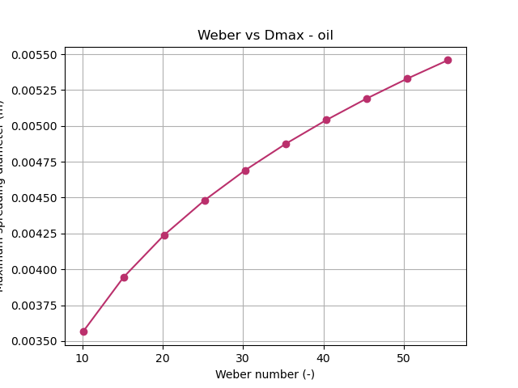

# 💧 Droplet Impact Simulation

## 📌 Overview

This project presents a physics-based simulation of droplet impact on solid surfaces, focusing on transient spreading dynamics governed by inertial, capillary, and viscous forces.
The goal is to bridge analytical fluid mechanics with computational visualisation.
---

## 🎬 Simulation Preview


---

## 📊 Results 

### 📈 Diameter Evolution


### 📈 Weber Scaling



---

## 🧪 Physics Model

The simulation is based on simplified governing principles:

* Free-fall velocity:
  v = √(2gH)

* Weber number:
  We = ρv²D / σ

* Maximum spreading law:
  Dₘₐₓ ∝ We^(1/4)

* Early-time spreading:
  R(t) ~ √(3R₀Vt)

* Post-impact recoil modelled using exponential decay

---
## ⚙️ Methodology

1. Compute impact velocity from release height
2. Detect impact time analytically
3. Apply the early-time spreading law
4. Introduce saturation and recoil
5. Visualise deformation using dynamic geometry

---

## 📁 Project Structure

```id="structure02"
src/        → simulation code  
data/       → fluid properties  
results/    → generated outputs  
docs/       → methodology notes  
```

---

## 🔬 Key Insights

* Spreading strongly depends on Weber number
* Inertial regime dominates early impact
* Recoil effects become visible post-maximum spread
* Geometry transition (sphere → film) captures physical intuition

---

## 🚀 How to Run

```bash
pip install -r requirements.txt
python src/main.py
```

---

## 📌 Applications

* Fuel injection systems
* Inkjet printing
* Surface coating processes
* Microfluidics

---

## 👩‍🔬 Author

**Aditi Atul Hiray**
M.Eng Mechatronics & Cyberphysical Systems

---

## ⭐ Acknowledgment

Inspired by classical droplet impact studies and reduced-order analytical models in fluid mechanics.
