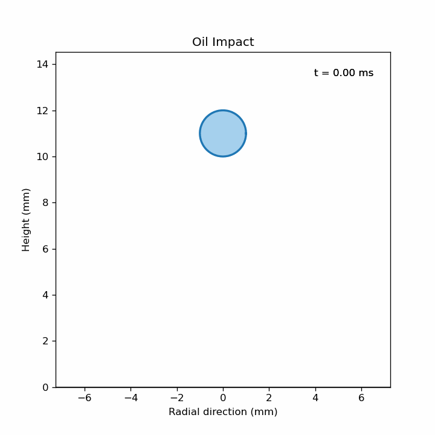

# 💧 Droplet Impact Simulation

A physics-based simulation and visualisation of a liquid droplet impacting a solid surface, developed using reduced-order fluid dynamics models.

---

## 🚀 Key Features

* 🟢 Free-fall droplet dynamics
* 🟢 Impact detection using physics-based criteria
* 🟢 Weber & Reynolds number evaluation
* 🟢 Analytical + semi-empirical spreading model
* 🟢 Realistic droplet deformation (sphere → thin film)
* 🟢 Fully animated visualisation with annotations

---

## 🎬 Simulation Preview



---

## 📊 Results & Analysis

### 📈 Diameter vs Time


### 📈 Weber Number vs Maximum Diameter


---

## 🧪 Physics Behind the Model

This project combines simplified fluid dynamics principles:

* Impact velocity:
  v = √(2gH)

* Weber number:
  We = ρv²D / σ

* Maximum spreading:
  Dₘₐₓ ∝ We^(1/4)

* Early-time spreading:
  R(t) ~ √(3R₀Vt)

* Post-impact recoil (viscous damping)

---

## ⚙️ How to Run

```bash
pip install -r requirements.txt
python main.py
```

---

## 📁 Project Structure

```
droplet-impact-simulation/
│
├── src/
│   └── main.py
├── data/
│   └── fluids.xlsx
├── output/
│   ├── Droplet_Annotated.gif
│   ├── Diameter_vs_Time_plot.png
│   └── Webber_No_vs_Dmax_plot.png
├── README.md
├── requirements.txt
```

---

## 📌 Inputs

* Fluid properties (density, viscosity, surface tension) from `fluids.xlsx`
* User-defined droplet release height

---

## 📤 Outputs

* Animated droplet impact visualisation (GIF)
* Diameter evolution plot
* Weber vs spreading diameter plot
* Maximum spreading metrics

---

## 🌟 Highlights

* Combines **physics + simulation + visualization**
* Designed for **engineering intuition & analysis**
* Easily extendable to:

  * different fluids
  * impact conditions
  * advanced splash modeling

---

## 👩‍💻 Author

**Aditi Atul Hiray**
M.Eng Mechatronics & Cyberphysical Systems

---
